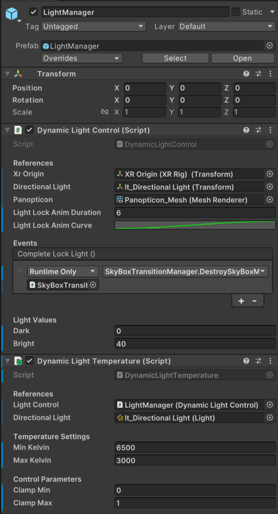
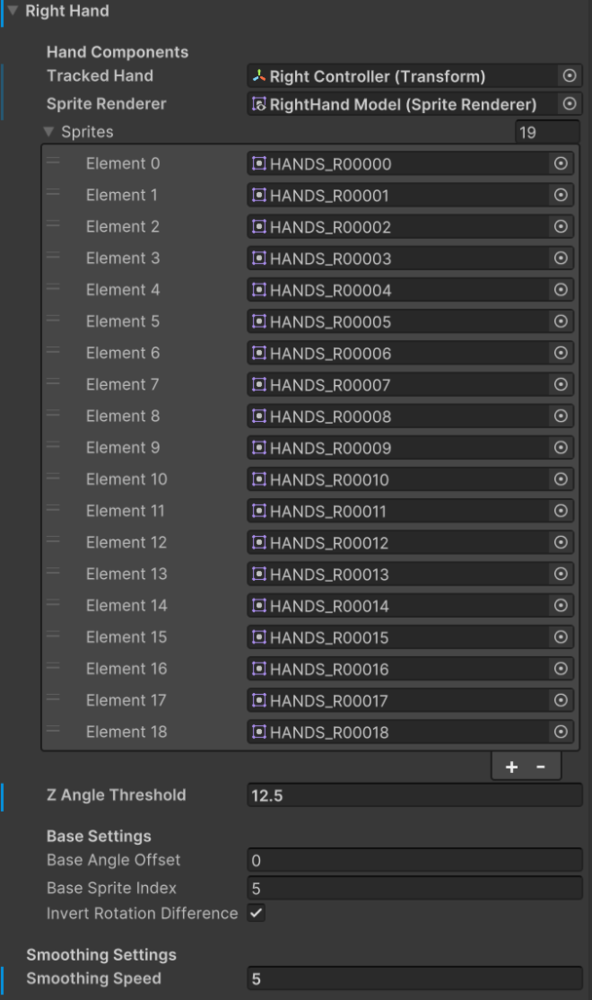
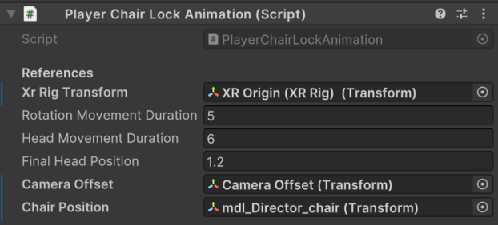

# Love Is Missing Home (VR Film)

**By Emri Passi**  
Technical Art, 3D Modeling & Texturing, and Unity Development

---

## Overview
"Love Is Missing Home" is a stop-motion-inspired VR experience that explores a man’s memory of his father through a poetic and immersive narrative. This breakdown focuses on the technical implementation behind the interactions, environmental logic, and runtime systems that power the experience.

---

## Role & Contributions
- Procedural 3D asset creation in Houdini (RBD, Vellum, VAT exports)
- Texturing in Substance Painter
- Custom Unity systems in C# for:
  - Gesture-based locomotion and turning
  - Environment lighting driven by player proximity
  - 2.5D hand sprite switching
  - Skybox transitions & fog behavior
  - Directed chair-triggered animation
- Modular event-driven scene architecture

---

## Trailer and walkthrough coming soon

---

## Project Architecture

### Game Director & Scene Managers

- **Game Director Prefab**
  - Contains `Director.cs` (Scene State tracker) and `SceneController.cs`
  - Uses `DontDestroyOnLoad()` to persist across scenes
  - Listens for global events via `EventBusMain.cs` (static event hub)

- **Scene Managers**
- 
- 
- 
  - Per-scene managers like `SceneOneManager`, `SceneFiveManager`
  - Raise UnityEvents to control flow (e.g. player enters trigger, animation completes)

### Lighting & Environment Transitions

- **Light Manager Prefab**
  - Contains `DynamicLightControl.cs` (controls directional light rotation based on player distance)
  - Also includes `DynamicLightTemperature.cs` (remaps rotation to Kelvin temperature)
  - **Artist Controls**: 
    - `dark`/`bright` values define the light angle limits
    - Animation curve and duration control light locking behavior

- **Skybox Transition Manager Prefab**
  - Contains `SkyBoxTransitionManager.cs` (blends between two skyboxes using a shader)
  - Includes `FogAnimationManager.cs` (remaps light progress to fog timeOfDay value)
  - **Artist Controls**:
    - `clampMin` and `clampMax` control the blend range
    - Material requires `_Texture1`, `_Texture2`, and `_Blend` properties in shader `Skybox Transition`

### Player-Driven Interactions

- **Animation Manager Prefab**
  - Contains two independent systems:
    - `PlayerZAxisAnimation.cs`: Used at the start of the film when the player has no control.
      - Smoothly animates the XR Origin forward along the Z-axis.
      - **Artist Controls**:
        - `targetZ`: Final Z position to move the player toward.
        - `totalDuration`: Total animation time.
        - `movementCurve`: Curve for custom easing behavior (e.g., ease in/out).
    - `PlayerChairLockAnimation.cs`: Used when the player enters the chair trigger zone.
      - Locks movement, rotates the player toward the stage, and adjusts vertical offset.
      - **Artist Controls**:
        - `rotationMovementDuration`: Duration of player turning toward the stage.
        - `headMovementDuration`: Duration of vertical camera offset movement.
        - `finalHeadPosition`: Y-axis target for headset (camera) alignment.
#### Gesture Movement

- **GestureLocomotion.cs**: Calculates forward motion from XR controller position.
- **GestureTurning.cs**: Turns player based on lateral offset of controllers.

#### Hand Sprite System

- **HandRotationManager.cs**: Changes hand sprites based on controller Z-axis.
- Uses **IgnoreParentZRollLook.cs** to ignore roll rotation from the parent XR controller, ensuring consistent sprite orientation.
- Calculates smoothed local Z-axis rotation, then maps rotation difference to a sprite index in a sprite array, creating turntable-style 2.5D system.
- Sprites are swapped based on defined angle thresholds, creating a directional visual feedback loop for hand gestures.

---

#### Chair Trigger

- **EnterChairTrigger.cs**: Detects entry, triggers animations.
- **PlayerChairLockAnimation.cs**: Locks XR Origin, rotates player toward stage, adjusts vertical offset.

---

## VAT Animation

- **VATController.cs**: Drives vertex animation texture playback for a looping destruction animation.
- Used for a Houdini RBD simulation baked to texture.
- Controlled via frame count and playback speed.

---

## Scripts
All scripts are located in `/Scripts`. Each is commented and modular. Artist-friendly variables are exposed in the inspector where relevant.

---

## Timeline
- Final project submitted as a school graduation piece.
- Source code is for review only, not for reproduction or redistribution.

---

## 🔗 Links
- [Vimeo Breakdown](https://vimeo.com/yourvideo)
- [Portfolio](https://your-portfolio-link.com)

> Trailer and full experience coming soon.

