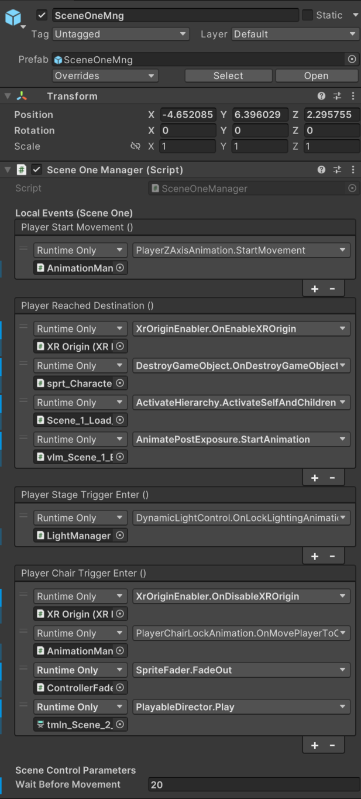
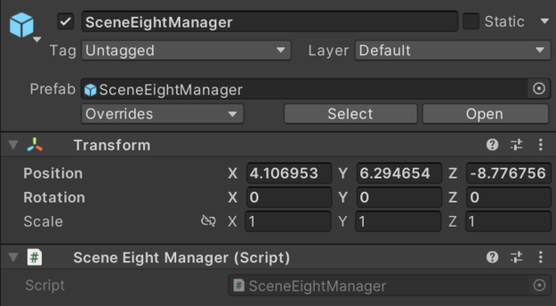

# Love Is Missing Home (VR Film)

**By Emri Passi**  
Technical Art, 3D Modeling & Texturing, and Unity Development

---

## Overview
"Love Is Missing Home" is a stop-motion-inspired VR experience that explores a man’s memory of his father through a poetic and immersive narrative. This breakdown focuses on the technical implementation behind the interactions, the editor tools built in Unity, and a bit of the architecture.

---

## Role & Contributions
- Procedural 3D asset creation in Houdini.
- Texturing done in Substance Painter.
- Custom Unity systems in C# for:
  - Gesture-based locomotion and turning
  - Dynamic environment lighting and skybox change (Day-Night transition) based on player world position.
  - 2.5D hand sprite switcher
  - Player movement lock and alignment with stage animation once trigger is entered.
- Modular event-driven scene and game architecture.

---

## Trailer
https://youtu.be/R2-BOwqri7M

---

## Project Architecture
The project uses a modular scene management system built around an event-driven architecture:
- 'SceneController.cs' is a singleton responsible for loading scenes asynchronously by index.
- 'SceneState.cs' (which has the 'Director' class inside) is a singleton that tracks the current scene state using an enum and handles scene progression.
- 'EventBusMain.cs' is a static event bus that allows any part of the project to signal when a scene is complete.
These scripts are part of the persistent **Game Director prefab**, which stays active across scenes.

### Game Director & Scene Managers

- **Game Director Prefab**
  Scene Flow:
  A scene invokes EventBusMain.SceneComplete() when its logic finishes (e.g., via animation or Timeline signal).
  Director listens for this event, updates its internal state, and tells SceneController to load the next scene.
  This architecture decouples scene-specific logic from scene loading, enabling centralized control and easier maintenance.
  
- **Scene Managers**

 - **SceneOneManager.cs**: Scene 1 is the main interactive scene, so its manager handles the most local events.
 Scene manager events are usually triggered indirectly—methods that invoke them are called by other events. For example, the "Animation Finished" event in PlayerZAxisAnimation.cs calls the "Player Reached Destination" method,
 which triggers a UnityEvent in the scene manager to start the post-exposure animation, enable player controls, activate models, and clean up unused GameObjects.
 This pattern continues throughout the scene. When the scene ends, the SceneTwoComplete method—responsible for triggering the 'EventBusMain.cs' event to change the scene—is called via a Timeline signal,giving the director precise control over when the scene ends.
  

The main role of the Scene Five and Eight managers is to call EventBusMain.cs methods that signal the end of the scene.

---

### Lighting & Environment Transitions

- **Light Manager Prefab**
  - Contains `DynamicLightControl.cs` (controls directional light rotation based on player distance)
  - This script dynamically adjusts a directional light’s X rotation based on the player’s distance from a specific location, using an objects boundaries as the max value, on the XZ plane.
  - Also includes `DynamicLightTemperature.cs`, which remaps the rotation to Kelvin temperature.
  - **Artist Controls**: 
    - `dark`/`bright` values define the light angle limits
    - Animation curve and duration control light locking behavior
    - 'Min/Max Kelvin' allow artist to choose maximum and minimum color temperature values.
    - Clamp parameters allow control over 0-1 values to allow for faster transitions and clamping values that don't visually affect the scene.

- **Skybox Transition Manager Prefab**
  - Contains `SkyBoxTransitionManager.cs` (blends between two skyboxes using a shader)
  - This script blends between two skybox textures (e.g., day and night) based on the DynamicLightControl's light rotation progress. It maps and clamps that value to control a _Blend parameter on a custom skybox material in real-time. Used for smooth environmental transitions tied to lighting changes.
  - Includes `FogAnimationManager.cs`, which remaps light progress to fog timeOfDay value.
  - **Artist Controls**:
    - `clampMin` and `clampMax` control the blend range
    - Material requires `_Texture1`, `_Texture2`, and `_Blend` properties in shader `Skybox Transition`

---

### Player-Driven Interactions

- **Animation Manager Prefab**
  - Contains two independent systems:
    - `PlayerZAxisAnimation.cs`: Used at the start of the film when the player has no control.
      - Smoothly animates the XR Origin forward along the Z-axis.
      - **Artist Controls**:
        - `targetZ`: Final Z position to move the player toward.
        - `totalDuration`: Total animation time.
        - `movementCurve`: Curve for custom easing behavior (e.g., ease in/out).
    - `PlayerChairLockAnimation.cs`: Used when the player enters the chair trigger zone.
      - Locks movement, rotates the player toward the stage, and adjusts vertical offset.
      - **Artist Controls**:
        - `rotationMovementDuration`: Duration of player turning toward the stage.
        - `headMovementDuration`: Duration of vertical camera offset movement.
        - `finalHeadPosition`: Y-axis target for headset (camera) alignment.
       
---

#### Gesture Movement

- **GestureLocomotion.cs**:
This script enables gesture-based forward movement in VR using the position and orientation of both controllers.
It calibrates the controllers' initial positions at Start().
In each frame, it calculates how far the controllers have moved forward (Z-axis) from their starting positions.
Once the movement surpasses the calibrationDistance, the player is moved forward based on movementSensitivity and capped by maxSpeed.
The direction of movement is averaged between the two controllers’ forward vectors.
  - **Artist-Friendly Control**:
    - movementSensitivity: Adjusts how responsive the movement feels.
    - calibrationDistance: Sets how far hands must move forward to trigger movement.
    - maxSpeed: Caps movement speed for comfort and control.
- **GestureTurning.cs**:
This script enables gesture-based turning by detecting lateral (X-axis) movement of the controllers.
It calibrates initial side positions of the controllers at Start().
If the average X-offset exceeds the turnActivationThreshold, the player rotates based on turnSensitivity.
  - **Artist-Friendly Control**:
    - turnSensitivity: Controls how fast the player rotates based on hand offset.
    - turnActivationThreshold: Defines the minimum lateral movement needed to initiate a turn.

---

#### Hand Sprite System

- **HandRotationManager.cs**:
Changes hand sprites based on controller Z-axis.
This script handles smooth sprite switching for VR hand visuals based on Z-axis rotation, offering precise control over sprite orientation and transition.
It uses a serializable HandRotationData class for both hands, which contains:
  - A tracked hand transform
  - A SpriteRenderer
  - A sprite array for different hand angles
  - Rotation thresholds and direction settings
On Update(), it:
  - Smoothly interpolates the hand’s Z rotation (smoothedAngle)
  - Computes the signed angle difference from a baseAngleOffset
  - Uses zAngleThreshold to calculate which sprite index to show
  - Optionally inverts the rotation difference (useful for left vs. right hand symmetry)
- **IgnoreParentZRollLook.cs**:
A companion script, which stabilizes hand sprite orientation in 3D space by removing the Z-axis roll of the parent (the controller).
  - Runs in LateUpdate() to override rotation after tracking updates.
  - Maintains forward direction while locking the up vector to world space.
  - Applies a customizable rotation offset (offsetEuler) to align 2D sprites correctly.

---

#### Chair Trigger

- **PlayerChairLockAnimation.cs**:
  This script animates the VR player’s XR rig into a seated position and adjusts the camera height for a smooth transition effect.
When OnMovePlayerToChair() is called, it:
  - Moves and rotates the XR rig (xrRigTransform) to match the position and orientation of a designated chairPosition over rotationMovementDuration.
  - Then, it adjusts the vertical position of the cameraOffset to a defined finalHeadPosition, simulating the player's head lowering into the chair.
- **Artist-Friendly Control**:
  - Exposed timing controls for both body and head transitions (rotationMovementDuration, headMovementDuration).
  - Adjustable final head height (finalHeadPosition) and target position reference (chairPosition) allow for precise scene setup and easy tuning in the Unity Inspector.

---

## Vertex Animation Textures

- **VATController.cs**: Drives vertex animation texture playback for a looping destruction animation.
- Used for a Houdini RBD simulation baked to texture.
- Controlled via frame count and playback speed.

---

## Timeline
- Final project submitted as a school graduation piece.
- Source code is for review only, not for reproduction or redistribution.

---

## 🔗 Links
- [Vimeo Breakdown](https://vimeo.com/yourvideo)
- [Portfolio Breakdown with 3D Models](https://www.emripassi.com/loveismissinghome)

